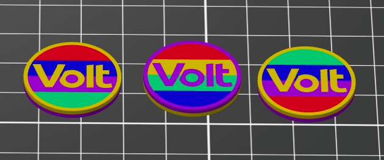

= Volt-Chip – Coin-Sized Volt Token
:toc:
:toc-title: Contents
:icons: font

image::resources/IMG_4666.png[Eight printed Volt chips in various two-colour combinations, 480]

== What is it?

The *Volt-Chip* is a small, round token the size of a *1 € coin* (≈ 23.25 mm diameter)
with the *Volt logo* raised on the front. A narrow rim runs around the edge. The back is
flat and smooth.

The chip works as a *badge, keyring token, or giveaway* and can be printed in any colour
combination. Two-colour variants (rim + logo in one colour, background in another) are the
simplest; multi-colour rainbow variants are also possible by using horizontal stripes in
the logo area.

The chip is built from *three layers*: a decorative front, a plain middle, and a decorative
back. Front and back can be coloured independently – for example violet on the front and
white on the back, or different motifs on each side. The *middle layer uses a single uniform
colour* with no filament changes, and can be printed with *low infill or even hollow* to
save filament and print time significantly.

The size is *parametric in Fusion 360* and can be freely adjusted.

== Photos

[cols="1,1,1,1", frame=none, grid=none, halign=center, valign=middle]
|===
| image:resources/IMG_4666.png[Eight physical chips in various two-colour combinations,200]
| 
| image:resources/IMG_6326.png[Large bag of violet/white chips ready for distribution,200]
| image:resources/IMG_7489.png[Three stacked boxes filled with printed chips,200]

| Printed variants | Slicer preview | Production batch | Bulk production
|===

== At a glance

[cols="1,3", frame=none, grid=rows]
|===
| Diameter | ≈ 23.25 mm (1 € coin size, parametric)
| Shape | Round disc with raised rim and raised Volt logo
| Layers | 3 (front, middle, back – each independently coloured)
| Back | Flat and smooth, independently coloured from the front
| Colour variants | 2-colour (background + logo) or multi-colour (rainbow stripes)
| Parametric | Yes – diameter and thickness adjustable in Fusion 360
|===

== Files in this folder

[cols="2,1,3", options="header"]
|===
| File | Type | Description

| `Volt-Chip-v8.f3d`
| Source
| Parametric Fusion 360 source file. Open to adjust diameter, thickness, logo
  size, or rim width.

| `Volt-Chip-v8.3mf`
| Print project
| Ready-to-print multi-material `.3mf`. Import into PrusaSlicer and assign
  extruder colours as needed.
|===

== Print configuration

The chip is designed for *2- to 5-colour printing*. On any printer that supports filament
changes (e.g. M600) even a single-extruder machine can produce two-colour variants.

[cols="1,2", frame=none, grid=rows]
|===
| Printer | Prusa XL (XL5IS), multi-tool (tested); any FDM printer for 2-colour
| Nozzle diameter | 0.4 mm
| Supports | not needed (flat part)
|===

=== Colour scheme

The chip has independently coloured regions across its three layers:

* *Front – background disc + rim* – e.g. white, yellow, or teal
* *Front – Volt logo* – accent colour, e.g. violet or gold
* *Middle layer* – a single uniform colour throughout; no filament changes occur here
* *Back* – can differ from the front (e.g. violet front / white back)

For rainbow variants, the background area of the front is split into horizontal stripes,
each assignable to a separate extruder.

=== Saving filament and print time

Because the *middle layer is always a single colour*, it never triggers a tool change.
Set it to low infill (e.g. 10–15 %) or even print it *hollow* in PrusaSlicer to cut
filament use and print time noticeably – the thin front and back shells keep the chip
rigid regardless.
