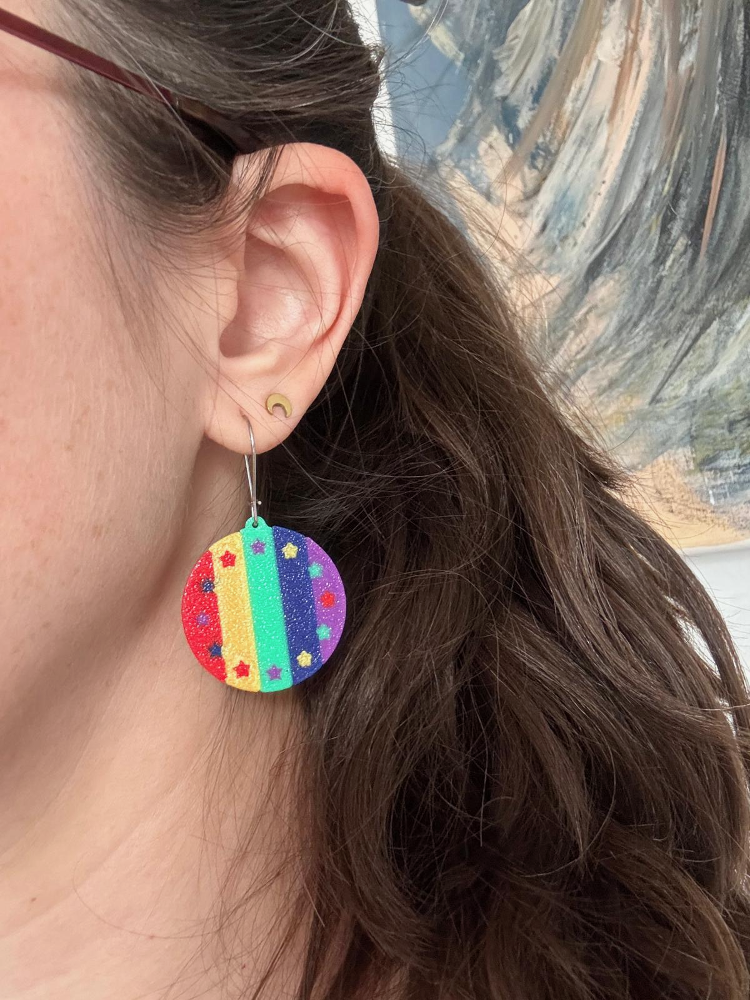

= EU-Ohrring – Volt Earring
:toc:
:toc-title: Contents
:icons: font

[cols="1,1", frame=none, grid=none, halign=center, valign=middle]
|===
| image:resources/ohrring-2c.png[Blue/yellow EU-style Volt earring worn, 320]
| 
|===

== What is it?

The *EU-Ohrring* ("EU earring") is a round, flat earring disc in the Volt look: a small
medallion with a ring of *12 yellow stars* and *10 individually coloured stripes* – inspired
by the European flag and Volt's visual identity.

The disc is designed in *two independent layers*: a plain base layer and a decorative top
layer with the stripes and stars. This lets you keep the base monochrome and only use
multi-colour printing for the top, which significantly reduces filament changes.

The *Volt logo* is engraved on the back – barely visible when worn, but a nice detail up
close.

A small loop at the top fits standard *earring hooks* (not included). The piece can be worn
as a simple everyday earring or as a colourful statement piece for events and
demonstrations.

[TIP]
====
Just looking or printing it out? Then this top section is all you need.
Everything below is for people who want to print or customise the model themselves.
====

== Photos

[cols="1,1,1,1", frame=none, grid=none, halign=center, valign=middle]
|===
| image:resources/IMG_4701.png[Front view: three earring variants on the print bed showing the star ring and glitter finish,200]
| image:resources/IMG_4700.png[Back view: same three variants – rainbow with stripes and plain blue,200]
| image:resources/IMG_4711.png[Two earrings side by side: left with stringing artefacts from insufficiently dried filament, right clean,200]
| image:resources/IMG_6266.png[A box full of printed earrings plus single-colour and small rainbow variants,200]

| Front + star ring | Back: rainbow + plain | Filament drying comparison | Production batch
|===

== At a glance

[cols="1,3", frame=none, grid=rows]
|===
| Diameter | 30 mm
| Shape | Round disc with top loop for earring hook
| Motif | 10 vertical stripes + 12-star ring (front), Volt logo engraved (back)
| Layers | 2 (base layer + stripe/star layer, independently coloured)
| Colour variants | 2-colour (e.g. blue/yellow or violet/white), 5-colour (rainbow), or up to 10 colours (one per stripe)
| Earring hardware | Standard earring hook, not included
|===

== Files in this folder

[cols="2,1,3", options="header"]
|===
| File | Type | Description

| `EU-Ohrring-Volt-v4.f3d`
| Source
| Parametric Fusion 360 source file. Open in Autodesk Fusion 360 to adjust
  dimensions, layer count, or geometry.

| `EU-Ohrring-Volt-v4.3mf`
| Print project
| Ready-to-print multi-material `.3mf`. Import into PrusaSlicer and assign
  extruder colours as needed.
|===

== Print configuration

The model is designed for *multi-colour printing*. Since the disc has 10 individually
assignable stripes and 12 individually assignable stars, the theoretical maximum is
*10 different colours* for the stripes alone – achievable with a large MMU or a
high-channel filament switcher such as the *Bondtech INDX*. A 5-tool setup (e.g.
*Prusa XL* XL5IS) covers the most common variants, and two-colour variants work on any
printer with a filament-change workflow (e.g. M600).

[cols="1,2", frame=none, grid=rows]
|===
| Printer | Prusa XL (XL5IS), multi-tool (tested)
| Nozzle diameter | 0.4 mm
| Supports | not needed (flat part)
|===

=== Colour variants

The stripes and stars can be freely assigned to extruders. Two especially striking
combinations:

[cols="1,3", options="header"]
|===
| Variant | Description
| *Blue / Yellow* | Solid EU-flag look – blue base and disc, yellow stars. Clean and
  recognisable as a Volt/EU piece.
| *Violet / White* | Classic Volt colours – violet base, white stripes and stars.
| *Rainbow (CSD)* | All 5 extruders in rainbow colours for stripes and stars – ideal for
  Pride events and CSD.
|===

=== Two-layer strategy (saving filament changes)

The disc is split into *two separate layers*:

* *Base layer* – printed first, fully monochrome (one extruder). This forms the body of the
  earring and the back with the logo engraving.
* *Stripe / star layer* – the decorative top layer. Here each of the 10 stripes and each of
  the 12 stars can be assigned an individual extruder.

For a plain blue/yellow earring, only *2 extruders* are needed in total. For a full
5-colour rainbow, you use all 5 – but even then the base stays single-colour and only the
top layer switches.

In PrusaSlicer, assign the base layer to a single extruder and distribute the stripes and
stars across your colour extruders in the top layer only.

=== Colour order in the slicer

[IMPORTANT]
====
Enter *bright/light colours first* in PrusaSlicer's extruder list. The Prusa XL prints
extruders in the order they are assigned, starting from the first. Bright colours printed
before dark ones avoid dark filament contaminating light surfaces.
====

=== Filament drying

[WARNING]
====
*Dry your filament thoroughly before printing – even PLA.* Moisture causes ultra-fine
stringing that wicks into adjacent bright colour zones and is very difficult to remove.
The comparison photo (IMG_4711) shows the difference clearly: the left earring was printed
with insufficiently dried filament (visible contamination in the lighter stripes), the right
one with well-dried filament (clean colour separation).

Recommended: dry PLA at 45–50 °C for at least 4–6 hours before a multi-colour print.
====
