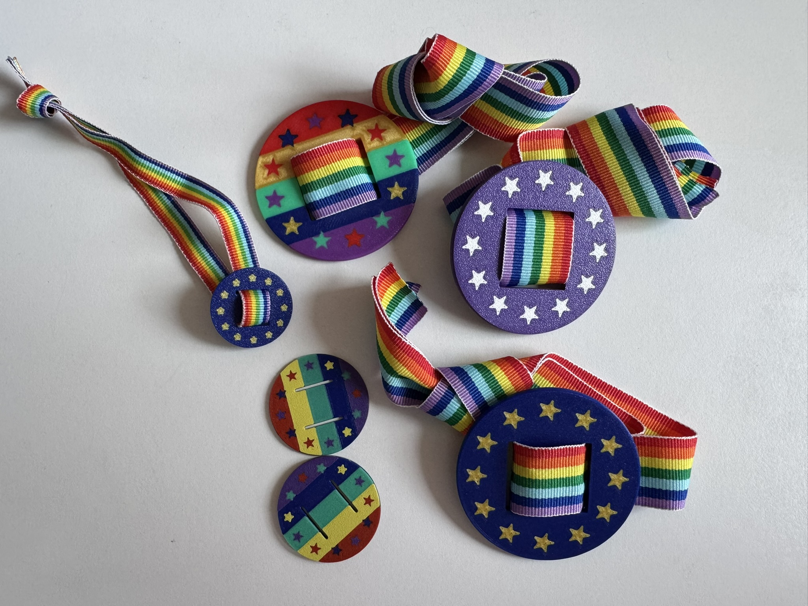
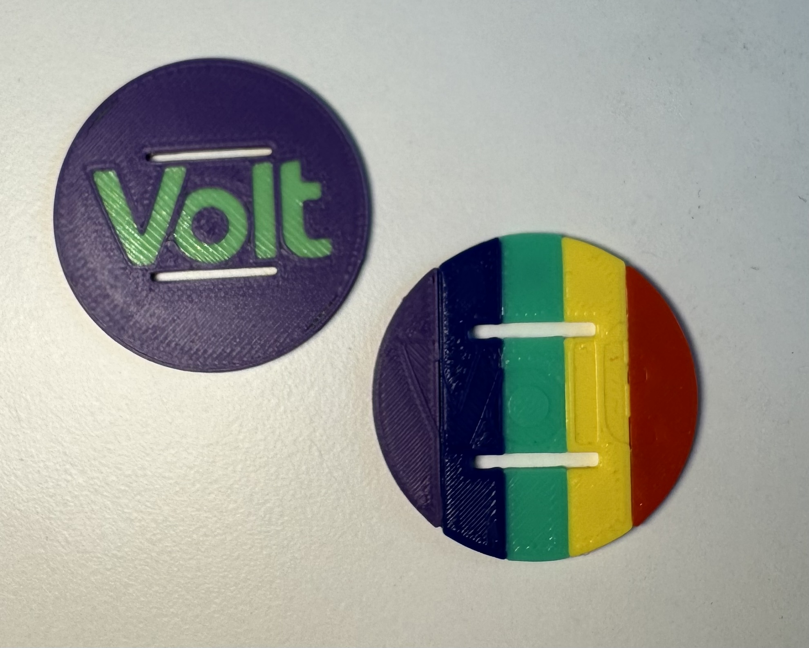
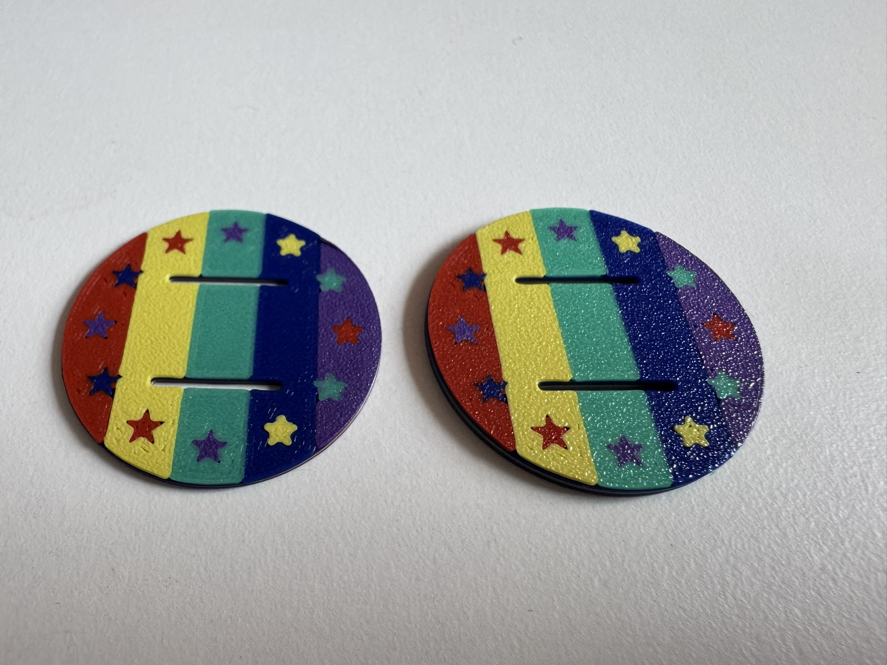
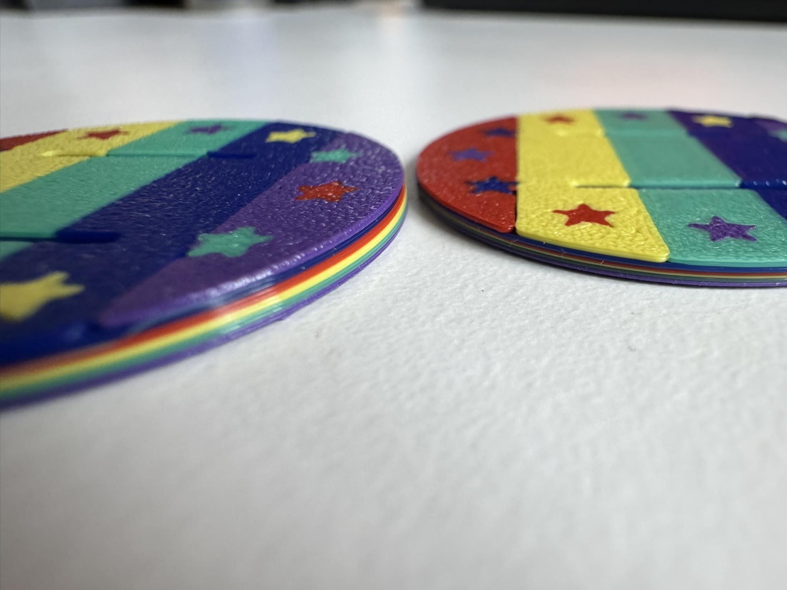
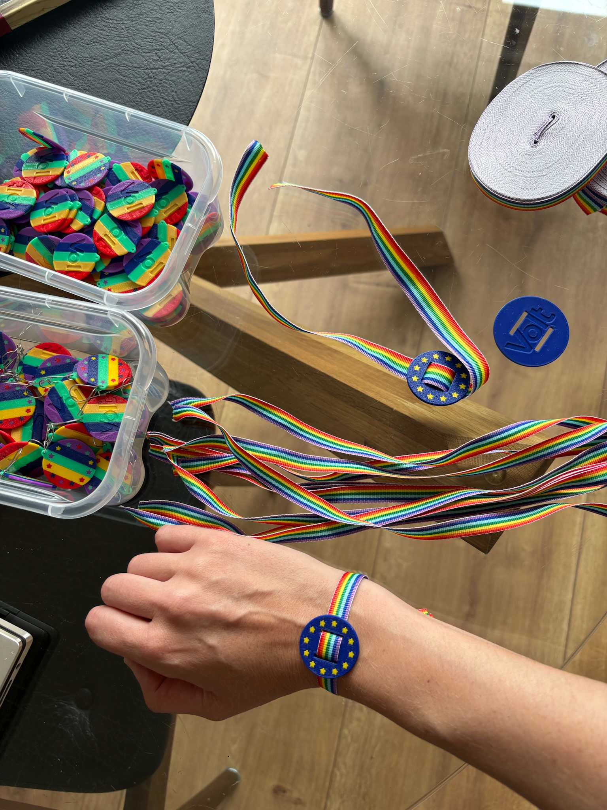
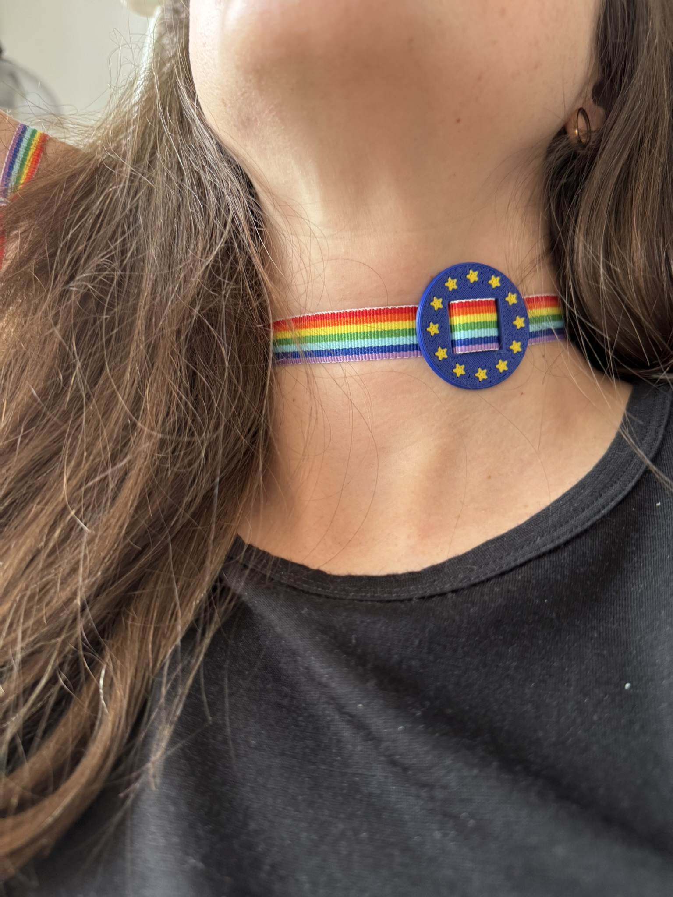
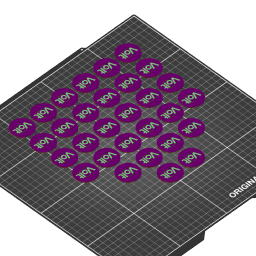

= EU-Schnalle – Medallion for a Bracelet or Necklace
:toc:
:toc-title: Contents
:icons: font

== What is it?

The *EU-Schnalle* ("EU buckle") is a round, flat medallion (37 mm diameter) in
the Volt look: a violet disc with a ring of *12 yellow stars* – inspired by the
stars of the European flag. The *Volt logo* is recessed into the back.

A *15 mm wide band* is threaded through two horizontal slots on the back. That
way the piece can be worn as a *bracelet* or as a *necklace* – depending on how
long the band is.

The model is deliberately thin and light (roughly 1–2.5 mm thick, depending on
the variant) and designed for *5-color printing*, so violet, yellow and the
other colors come straight off the printer without any painting.

[TIP]
====
Just looking or printing it out? Then this top section is all you need.
Everything below is for people who want to print or customize the model
themselves.
====

== Photos

[cols="1,1,1,1,1", frame=none, grid=none, halign=center, valign=middle]
|===
| 
| 
| 
| 
| 

| Back: new vs. old | Front | Color layers at the edge | As a bracelet | As a necklace
|===

== At a glance

[cols="1,3", frame=none, grid=rows]
|===
| Diameter | 37 mm
| Thickness | ~1.2 mm to ~2.4 mm (depending on the variant)
| Band width | 15 mm (two slots, 14 mm apart)
| Wearing options | Bracelet or necklace
| Motif | Volt logo (back) + 12-star ring (front)
| Colors | 5-color print (violet, yellow, red, blue, light green)
|===

== Files in this folder

There are two kinds of files: the *parametric source* (for customizing) and
ready-made *`.3mf` files* (for printing). Among the `.3mf` files there is a
distinction between plain *model exports* from OpenSCAD and already
*print-ready PrusaSlicer projects* (with color assignment and printer profile).

[cols="2,1,3", options="header"]
|===
| File | Type | Description / parameters

| `EU-Schnalle-backplate.scad`
| Source
| Parametric OpenSCAD model. All dimensions (diameter, layer count, star count,
  slots, logo) are defined at the top of the file.

| `export-EU-Schnalle-backplate.sh`
| Script
| Builds the named multi-material `.3mf` files from the `.scad`. Arguments:
  layer height, output file, star-layer height.

| `EU-Schnalle-backplate.3mf`
| Model
| Canonical export, *uniform 0.4 mm* per layer (total thickness ~2.4 mm).
  *Do not rename* – the PrusaSlicer plates reference it.

| `EU-Schnalle-backplate-0.2mm.3mf`
| Model
| Export with *uniform 0.2 mm* per layer (total thickness ~1.2 mm).

| `EU-Schnalle-backplate-base0.2-stars0.4.3mf`
| Model
| *Thin base (0.2 mm), thick star layer (0.4 mm)* (total thickness ~1.4 mm).

| `EU-Schnalle-backplate-0.2mm-XL.3mf`
| Print project
| PrusaSlicer project for the Prusa XL, *0.2 mm* layer height, *1 piece*.

| `EU-Schnalle-backplate-XL-5c-1.3mf`
| Print project
| PrusaSlicer project, 5 colors, *0.25 mm* layer height, *1 piece*.

| `EU-Schnalle-backplate-XL-5c-30.3mf` (`…-02mm-30`)
| Print project
| PrusaSlicer project, 5 colors, *0.2 mm* layer height, *30 pieces* on the plate.

| `EU-Schnalle-backplate-XL-5c-56.3mf`
| Print project
| PrusaSlicer project, 5 colors, *0.2 mm* layer height, *56 pieces* on the plate.
  Note: uses the 0.4 mm model geometry (2.4 mm thick) but is sliced at
  0.2 mm (two print layers per color band).
|===

== Print configuration

The model is designed for *5-color printing*, e.g. on the *Prusa XL*
(model XL5IS) with a multi-tool head.

[cols="1,2", frame=none, grid=rows]
|===
| Printer | Prusa XL (XL5IS), multi-tool
| Nozzle diameter | 0.4 mm
| Layer height | 0.2 mm (variants also 0.25 / 0.4 mm)
| Colors | 5 (one tool/extruder per color)
| Supports | not needed (flat part)
|===

=== Color scheme (extruder assignment)

[cols="1,1,2", options="header"]
|===
| Extruder | Color | Usage
| 1 | Yellow `#FFFF00`      | Stars / accents
| 2 | Light green `#90EE90` | Accents
| 3 | Red `#FF0000`         | Accents
| 4 | Blue `#0000FF`        | Accents
| 5 | Violet `#800080`      | Base disc (Volt violet)
|===

The medallion is built up from bottom to top: several *base layers*, then a
*star layer* with the 12-star ring. The print-ready PrusaSlicer projects
(`…-XL-…`) already contain the finished color assignment for all layers,
stripes and stars.

=== Threading the band

The chosen band (15 mm wide) is threaded from the back through the two slots.
Length as desired:

* short band → *bracelet*
* long band → *necklace*

== Customizing and re-exporting

The geometry is defined parametrically in `EU-Schnalle-backplate.scad` and can
be freely edited in https://openscad.org/[OpenSCAD] (diameter, layer and star
count, slot dimensions, logo).

After changes, regenerate the `.3mf`:

[source,bash]
----
cd schnalle
./export-EU-Schnalle-backplate.sh                                             # uniform 0.4 mm
./export-EU-Schnalle-backplate.sh 0.2 EU-Schnalle-backplate-0.2mm.3mf          # uniform 0.2 mm
./export-EU-Schnalle-backplate.sh 0.2 EU-Schnalle-backplate-base0.2-stars0.4.3mf 0.4  # base 0.2 / stars 0.4
----

Requirements: `openscad` and `python3` in `PATH`. Details, pitfalls and the
exact part/color assignment are documented in `AGENTS.md` in the root folder.
